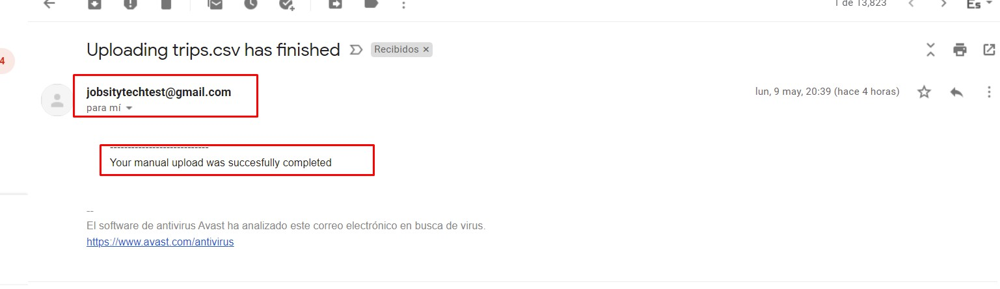
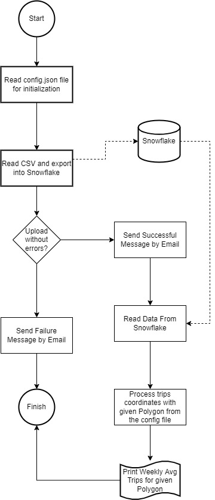
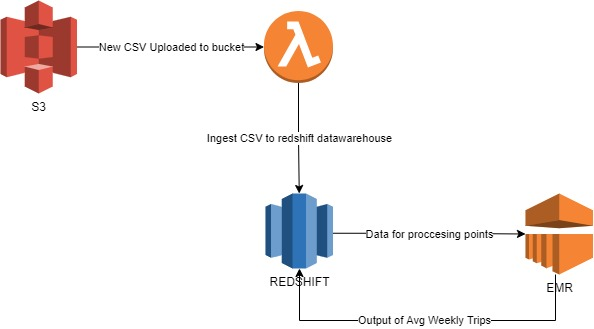

# App description

This app was built to read a csv file from a local storage and upload it to a database in snowflake. The program will read the file in chunks to overcome memory issues for big files.

After that it reads the data from there and process the weekly average number of trips for a given region. Note: I've used the shapely library to accomplish this task.

You can test the app by building the container inside it and following the steps below.

The username and password for snowflake is in the email sent

[How to use the app](#how-to-use-the-app)

## Assumptions and considerations

* I considered that a trip is inside a polygon if the origin coordinate is in the polygon.

* The final user has to mount the local path into the container as described on the section below.

* Since I am using PySpark this script is scalable for large datasets.

* In the config file there is a "recipient" key where you can set a new email address so the process will send the status of the ingestion process. This is an example of the email after the process has finished uploading the data to snowflake



# How it works

The app needs a config file

Here is a diagram of how the app works.




# How to use the app

Pre-requisites:

You must have docker installed on your machine. **There is a video on the resources folder.**

1. Download this repo
2. Open a command prompt
3. Go to the project's path
4. Execute this command to build the image:
```sh
    docker build -t jobsity-app .
```
5. Run the image and create a container:
```sh
docker run -p 8888:8888 -v "C:/input":"/home/jovyan/work/jobsity/input" jobsity-app
```
Note: Instead of "C:/input" you must specify the path where the config.file and the csv are located from your local machine

6. Open the container command line inside docker and execute the following commands:

```sh
cd work/jobsity/

pipenv shell

pipenv install
```
7. To execute the program you must run this command:
```sh
spark-submit --packages net.snowflake:snowflake-jdbc:3.13.14,net.snowflake:spark-snowflake_2.12:2.10.0-spark_3.1 main.py "trips.csv"
```


You should get the results like the video.

To check that table was populated from the process you need to go to Snowflake: 

https://app.snowflake.com/us-east-1/nkb53754/data/databases/JOBSITY/schemas/TRIPS/


# Explaining the config file

In this file we specify the credentials for snowflake and the destination table for the upload process. We also set the credentials for the email user that the job will use to send email notifications. Finally, it also contains the polygon that is going to be used on the program to calculate the average weekly trips for the region defined by the polygon.

```json
{
    "credentials": {
        "user": <USER>,
        "password": <PASSWORD>,
        "account": <SNOWFLAKE ACCOUNT NAME>
    },
    "destination": {
        "warehouse": <WAREHOUSE>,
        "database": <DESINATION DATABASE>,
        "schema": <SCHEMA>,
        "table": <DESINATION DATABASE>
    },
    "email_config": {
        "user": <EMAIL USER>,
        "password": <EMAIL PASSWORD>,
        "recipient": <USER WHO WILL RECEIVE THE NOTIFICATION>
    },
    "polygon": <REGION>
    /*The format of the polygon string must be like the following. Note that the first and last point must have the same coordinates.
    # POLYGON((7.513135087952872 45.04417775442011, 7.56304564848932 44.97612466562052, 7.671077441892763 45.00676340143624, 7.739660019780326 45.10100884469237, 7.513135087952872 45.04417775442011))*/
}
```

# Additional requested features

1. The container definition file is inside the project
2. This would be the diagram for an amazon solution for this project: 

3. The SQL queries are insider the [SQL](sql/) folder

You can test that the query works inside snowflake

https://app.snowflake.com/us-east-1/nkb53754/worksheets

There are two worksheets called "cheap_mobile_regions" and "latestdatasource". Inside them are the queries where you can run them and see the results.


